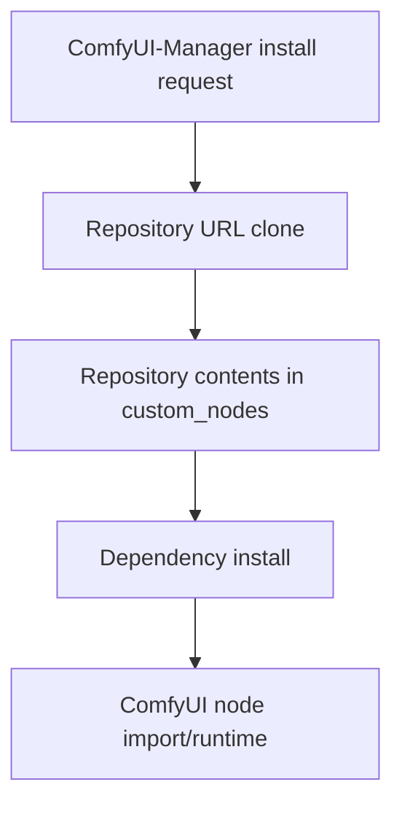

# Specification: Manager Install Failure Diagnosis

**Date**: 2026-04-11  
**Agent**: vibe-flow  
**Status**: Draft  
**Related Plan**: `.github/plans/in-progress/app/distribution/github-actions/manager-install-failure-2026-04-11/`  
**Based on Research**: `2-RESEARCH.md`

---

## 0. Business Context

### Problem Statement

ComfyUI-Manager fails to install this custom node from its GitHub repository, reporting a `git clone` failure with exit code 128.

### User Impact

Users cannot install the custom node through the standard Manager flow even though the repository is public.

### Success Criteria

- [x] The failing install phase is identified
- [x] The repository-side fix or environmental blocker is clear
- [x] The diagnosis distinguishes clone-layer failure from build/runtime failure

### Scope

**In Scope:**

- Repository URL/accessibility validation
- Manager install path diagnosis
- GitHub Actions publishing relevance
- Minimal repo-side remediation, if applicable

**Out of Scope:**

- Unrelated runtime node functionality changes
- Broad packaging redesign unless required by the diagnosis

---

## 1. Executive Summary

### What are we determining?

Why ComfyUI-Manager is cloning a non-resolving GitHub URL for this node even though the actual repository is public, and what metadata must change for installs to succeed.

### Why?

The current failure blocks the primary distribution path for the custom node.

### Success Metrics

- The `git clone` exit 128 is explained by the repository URL mismatch
- The fix path is concrete and directly testable
- Unrelated factors, such as post-clone build output and GitHub Actions build steps, are separated from the actual blocker

### Determination

ComfyUI-Manager is attempting to clone `https://github.com/sammykumar/imagegen_toolkit_dev_utils`, which is the URL published in `pyproject.toml` but not the repository's actual slug. The real public repository is `https://github.com/sammykumar/ImageGen-Toolkit-Dev-Utils`. Because the published slug 404s, `git clone` fails with exit code 128 before any dependency installation or runtime import.

---

## 2. Architecture Design

### System Overview

### Key Architectural Decisions

**Decision 1**: Treat cloneability as the first gate

- **Rationale**: The log fails in raw `git clone` before later install phases.
- **Alternatives Considered**: Focusing first on GitHub Actions artifacts.
- **Trade-offs**: May rule out the workflow as irrelevant to the current failure.

**Decision 2**: Treat published repository metadata as the control point for Manager installs

- **Rationale**: The failing clone target matches `[tool.comfy].Repository` in `pyproject.toml`.
- **Alternatives Considered**: Treating README guidance or workflow artifacts as the source of truth.
- **Trade-offs**: Requires metadata correction and likely republishing, but avoids unnecessary workflow or runtime changes.

---

## 3. API / Interface Changes

No API changes are planned for diagnosis alone.

---

## 4. Data Model Changes

No data changes are planned.

---

## 5. Implementation Steps

### Phase 1: Diagnose clone-layer failure

**Goal**: Explain the exit-128 failure.

**Tasks**:

1. Validate repository URL and git accessibility.
2. Check whether the Manager install target matches the actual repo owner/name.
3. Determine whether workflow publishing participates in installation.

**Deliverables**:

- [x] Root cause statement
- [x] Minimal remediation path

**Estimated Effort**: <0.5 day

---

## 6. Impact Analysis

### Files to Modify

Required for the actual remediation:

- `pyproject.toml`

Recommended but not required for the clone failure itself:

- `README.md`

No change required for diagnosis or for the direct install failure:

- `.github/workflows/vite-build.yml`

### Minimal Remediation

1. Update `[tool.comfy].Repository` in `pyproject.toml` to `https://github.com/sammykumar/ImageGen-Toolkit-Dev-Utils`.
2. Update `[project.urls]` entries in `pyproject.toml` to the same real repository slug for consistency.
3. Republish registry metadata through the existing publish path so ComfyUI-Manager no longer receives the bad URL.
4. Optionally fix `README.md` placeholders and the stale development clone example.

### Non-Goals

- No Python or frontend code changes are needed for this failure.
- No GitHub Actions workflow logic change is needed unless later evidence shows the publish action overrides the corrected metadata.
