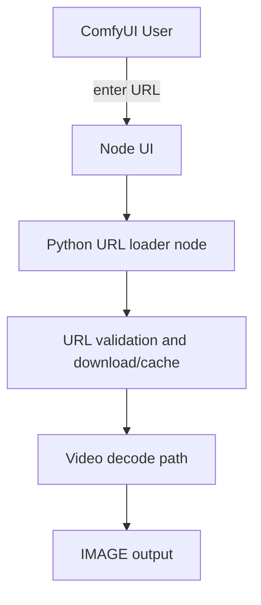
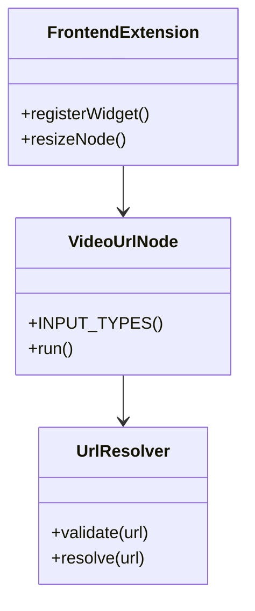
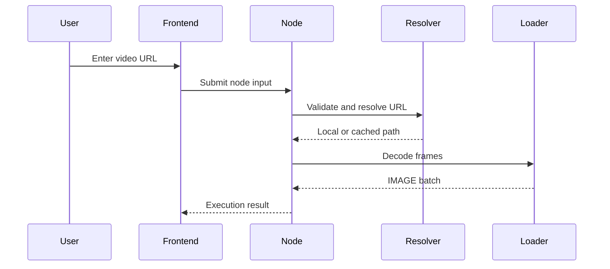

# Specification: Load Video URL Node

**Date**: 2026-04-11  
**Agent**: research.agent  
**Status**: Approved  
**Related Plan**: `.github/plans/in-progress/app/nodes/video/load-video-url-node-2026-04-11/`  
**Based on Research**: `2-RESEARCH.md`

---

## 0. Business Context

### Problem Statement

The current repo demonstrates a custom ComfyUI node with a Vue widget, but it does not provide a way to load video from a remote URL. Users who already have hosted media must upload it manually before it can enter a workflow.

This work is intended to preserve the same core behavior as `comfyui-videohelpersuite -> VHS_LoadVideo` and add URL input as an additional source mechanism, without requiring VideoHelperSuite to be installed.

### User Impact

Users can point the node at a remote asset directly, which reduces friction for cloud-hosted or shared media workflows.

### Success Criteria

- [ ] A new node accepts a remote video URL as input.
- [ ] The node returns a baseline-compatible video frame output for downstream nodes.
- [ ] Invalid or unreachable URLs fail with clear error messages.
- [ ] The node does not import or require VideoHelperSuite at runtime.
- [ ] Prompt validation accepts ComfyUI raw control values without collapsing errors onto `frame_load_cap`.
- [ ] `video_url` rejects non-string values with a URL-specific validation message.
- [ ] `0` retains VHS-style meaning for video-native defaults instead of being treated as an invalid override.

### Scope

**In Scope:**

- New URL-based video loader node definition
- URL validation, download/resolve behavior, and caching strategy
- Minimal frontend support for URL entry

**Out of Scope:**

- Full media library management
- Arbitrary authenticated remote providers in v1

---

## 1. Executive Summary

### What are we building?

A new ComfyUI custom node that takes a video URL, resolves it into a locally usable asset, and loads frames with the same core behavior and controls as `VHS_LoadVideo`, implemented directly in this package.

### Why?

The upload-based workflow is too manual for remote-first media sources. A URL-driven node is a better fit for reusable, hosted assets.

### Success Metrics

- URL input can be entered and persisted in the workflow graph
- Direct `.mp4` URL loads successfully in the happy path
- Repeat executions avoid unnecessary duplicate downloads when cache is still valid

---

## 2. Architecture Design

### System Overview



### Component Diagram



### Data Flow



### Key Architectural Decisions

**Decision 1**: Separate URL resolution from decode logic

- **Rationale**: Keeps remote-fetch behavior isolated and testable.
- **Alternatives Considered**: Mixing download logic directly into frontend upload behavior.
- **Trade-offs**: Adds one more helper boundary, but makes failures clearer.

**Decision 2**: Treat `Load Video (Upload)` as a behavior baseline, not a backend implementation baseline

- **Rationale**: The upload node matches the intended user-facing capability, but the path node matches the required input contract.
- **Alternatives Considered**: Directly cloning upload code.
- **Trade-offs**: Requires selective reuse rather than direct copy.

**Decision 3**: Remove runtime delegation to VideoHelperSuite

- **Rationale**: The user explicitly wants recreated behavior, not a transitive runtime dependency.
- **Alternatives Considered**: Keeping the current `videohelpersuite.load_video_nodes.LoadVideoPath` import path.
- **Trade-offs**: Internal loader code and test coverage must now live in this package.

**Decision 4**: Target `VHS_LoadVideo`, not `VHS_LoadVideoFFmpeg`

- **Rationale**: `VHS_LoadVideo` is the exact node the user named, and in VideoHelperSuite it maps to `LoadVideoUpload`, the non-ffmpeg upload variant.
- **Alternatives Considered**: Using the ffmpeg variant as the first parity target.
- **Trade-offs**: If ffmpeg-specific capabilities are later needed, they can be added as a second node or second phase.

---

## 3. API / Interface Changes

### New Interfaces

```typescript
interface VideoUrlNodeInput {
  video_url: string;
  force_rate?: number;
  frame_load_cap?: number;
  skip_first_frames?: number;
  select_every_nth?: number;
  custom_width?: number;
  custom_height?: number;
}
```

### Modified Interfaces

```typescript
// BEFORE
interface ExampleNodeInput {
  custom_vue_component_basic: unknown;
}

// AFTER
interface ExampleNodeInput {
  custom_vue_component_basic?: unknown;
  video_url?: string;
}
```

### Validation Semantics Addendum

- `video_url` must validate as a string input before URL normalization.
- Numeric controls must tolerate the raw scalar shapes ComfyUI sends during prompt validation, then coerce or reject each field independently with the correct field name.
- `force_rate = 0` means use the source video FPS.
- `custom_width = 0` and `custom_height = 0` mean preserve source dimensions unless the paired dimension requests aspect-ratio-derived resizing.
- `frame_load_cap = 0` means no explicit cap, matching the current video-driven behavior.
- `skip_first_frames = 0` remains a valid no-skip default.
- `select_every_nth = 1` remains the baseline "load every frame" value; `0` is not introduced there because it would create an invalid sampling step.

### API Endpoints

#### New Endpoints

No external HTTP endpoints are planned. The node executes inside ComfyUI and may issue outbound HTTP requests to resolve the remote media.

#### Modified Endpoints

No existing HTTP endpoints are modified.

---

## 4. Data Model Changes

### New Tables/Collections

No database changes are planned.

### Modified Tables/Collections

No database changes are planned.

**Migration Script**:

```sql
-- No schema migration required.
```

---

## 5. Implementation Steps

### Phase 1: Foundation

**Goal**: Define the node and choose the runtime loading baseline.

**Tasks**:

1. Create a dedicated URL-based node class and mapping.
2. Preserve the `VHS_LoadVideo` control surface as closely as practical: `force_rate`, `frame_load_cap`, `skip_first_frames`, `select_every_nth`, optional `vae`, and baseline outputs.
3. Add the basic URL input contract.

**Deliverables**:

- [ ] New node registration
- [ ] URL input definition
- [ ] `VHS_LoadVideo` parity target documented

**Estimated Effort**: 0.5-1 day

---

### Phase 2: Core Logic

**Goal**: Resolve remote media and decode frames.

**Tasks**:

1. Implement URL validation and scheme restrictions.
2. Download or cache remote files to a local path.
3. Implement the actual video loading routine internally.
4. Return actionable errors for invalid inputs.

**Deliverables**:

- [ ] Resolver helper
- [ ] Remote download path
- [ ] Internal decode integration
- [ ] Error handling

**Estimated Effort**: 0.5-1.5 days

---

### Phase 3: Polish & Optimization

**Goal**: Improve UX, avoid wasteful downloads, and document behavior.

**Tasks**:

1. Add optional Vue-backed URL widget or keep native string input.
2. Implement cache reuse behavior.
3. Document supported URL patterns and limitations.

**Deliverables**:

- [ ] Frontend input experience finalized
- [ ] Cache behavior documented
- [ ] README updated

**Estimated Effort**: 0.5-1 day

---

## 6. Impact Analysis

### Files to Create

| File Path                     | Purpose       | Size Est. | Priority |
| ----------------------------- | ------------- | --------- | -------- |
| `src/components/LoadVideoUrlNode.vue` | Optional URL-specific widget | ~100 LOC  | P1 |
| `doc/load-video-url-node.md` | Optional usage notes | ~50 LOC  | P2 |

### Files to Modify

| File Path             | Current Role  | Changes Needed         | Risk   |
| --------------------- | ------------- | ---------------------- | ------ |
| `ComfyUIFEExampleVueBasic.py` | Current node backend | Add or factor out new video URL node | 🟡 Med |
| `__init__.py` | Node export/registration | Export new node mapping | 🟢 Low |
| `src/main.ts` | Frontend extension | Add widget registration if needed | 🟡 Med |
| `README.md` | User documentation | Remove VHS dependency claim and add self-contained usage notes | 🟢 Low |

### Files to Delete

| File Path               | Reason                           | Replacement      |
| ----------------------- | -------------------------------- | ---------------- |
| None                    | No planned deletions             | N/A              |

---

### Dependencies

**New Dependencies**:

```json
{}
```

**Updated Dependencies**:

```json
{}
```

---

### Breaking Changes

#### Change 1: `Load Video URL` becomes self-contained rather than VHS-backed

**Impact**: Users no longer need VideoHelperSuite installed for the supported path.

**Before**:

```typescript
// Only the example Vue drawing node exists.
```

**After**:

```typescript
// Example node remains; a new URL-based video node is added alongside it.
```

**Migration Path**:

1. Keep the existing example node registered.
2. Register the new video URL node with a distinct name.
3. Update docs to distinguish the two.

**Deprecation Timeline**:

- No deprecation planned.

---

## 7. Testing Strategy

### Unit Tests

**Coverage Target**: 85%+ for new helper logic

**Focus Areas**:

- URL validation
- Cache key/path behavior
- Error classification for invalid and unreachable URLs
- Resolver behavior for direct video URLs
- Parity of control handling versus `VHS_LoadVideo`

**Test Files**:

- `tests/test_load_video_url_node.py` or equivalent Python test file

---

### Integration Tests

**Focus Areas**:

- Node execution with a reachable sample URL
- Node execution with a failing URL
- Repeat execution with cache reuse

**Test Files**:

- To be chosen once the local test harness is identified

---

### E2E Tests

**Critical User Paths**:

1. **Happy Path**: User enters a direct video URL and receives frames
   - Setup: Reachable sample `.mp4` URL
   - Steps: Create node, paste URL, execute workflow
   - Expected: `VHS_LoadVideo`-style output produced with no manual upload

2. **Error Path**: User enters an invalid or unreachable URL
   - Setup: Invalid or dead URL
   - Steps: Execute workflow
   - Expected: Clear execution error with remediation hint

**Test Files**:

- Manual runtime validation initially; automate if the repo gains a workflow test harness

---

### Test Data Strategy

**Fixtures**:

- Small public sample video URL for happy path
- Invalid URL samples for negative cases

**Factories**:

- Not required initially

**Database State**:

- No database state required

---

## 8. Security Considerations

### Authentication

- No user authentication planned in v1
- Authenticated remote sources are out of scope initially

### Authorization

- Node execution follows existing ComfyUI local runtime permissions

### Data Protection

- Downloaded remote media should land in a predictable local cache or temp path
- Avoid logging full sensitive URLs if query strings may contain tokens

### Input Validation

- Restrict to explicit schemes such as `http` and `https`
- Reject empty, malformed, or unsupported URLs before attempting download
- Prefer filename/content-type checks before decode when possible

### Rate Limiting

- No built-in rate limiting planned in v1
- Cache reuse should reduce accidental repeat fetches during iterative runs

---

## 9. Performance Considerations

### Expected Load

- **Requests/sec**: Very low; node-driven local execution
- **Concurrent Users**: Typically one local operator per ComfyUI instance
- **Data Volume**: Potentially large video files

### Performance Targets

- **First fetch latency**: dominated by remote download
- **Repeat execution**: should avoid re-downloading when cache is valid
- **Decode path**: should remain in line with the chosen local video loader baseline

### Optimization Strategies

- Cache remote media locally
- Reuse existing decode path instead of duplicating frame logic
- Keep frontend lightweight to avoid unnecessary browser work

### Monitoring

- Log cache hit/miss behavior during development
- Log download failures and decode failures distinctly

---

## 10. Rollout Plan

### Phase 1: Internal Testing

- **Duration**: 1 day
- **Audience**: Local development only
- **Success Criteria**: Happy-path URL load and clear invalid-URL failure

### Phase 2: Beta Release

- **Duration**: 1-2 days
- **Audience**: Personal workflows in this repo
- **Success Criteria**: Cache behavior acceptable and no regressions in existing example node
- **Rollback Trigger**: Repeated download issues or broken node registration

### Phase 3: General Availability

- **Date**: TBD after implementation
- **Communication**: README update
- **Support Plan**: Document known limitations and fallback workflow

---

## 11. Acceptance Criteria

### Functional Requirements

- [ ] New node accepts a URL string
- [ ] New node resolves a reachable remote video and loads frames with `VHS_LoadVideo`-compatible behavior
- [ ] Invalid or unsupported URLs fail with clear errors

### Non-Functional Requirements

- [ ] Cache reuse avoids unnecessary repeat downloads
- [ ] Control surface and output parity with `VHS_LoadVideo` are documented and verified
- [ ] Documentation complete
- [ ] Tests passing with >80% coverage where a local harness exists

### Definition of Done

- [ ] Code implemented and reviewed
- [ ] Focused tests passing
- [ ] Documentation updated
- [ ] Existing example node still works
- [ ] Ready for local production use

---

## 12. Risks and Mitigation

| Risk     | Impact | Likelihood | Mitigation Strategy | Owner       | Status     |
| -------- | ------ | ---------- | ------------------- | ----------- | ---------- |
| Remote servers reject downloads or require auth | Medium | Medium | Scope v1 to public direct URLs and document unsupported cases | Team | Monitoring |
| Very large videos consume time or disk | High | Medium | Document expectations and add cache/temp cleanup strategy | Team | Monitoring |
| Output parity chosen incorrectly | Medium | Medium | Decide early whether to match plain or ffmpeg VHS variant | Team | Monitoring |

---

## 13. Open Questions

- [ ] Should v1 ship with full `VHS_LoadVideo` output parity immediately, or can audio/video-info be staged if implementation complexity is higher than expected?
- [ ] Do we want a plain string widget first, or a Vue URL input with validation affordances?
- [x] ~~Should this replace the existing example node?~~ - Answer: No, it should be added alongside it.

---

## 14. References

### Related Documentation

- [Progress & Tasks](1-PROGRESS.md)
- [Research Document](2-RESEARCH.md)
- [README](../../../../../../README.md)

### External Resources

- [ComfyUI-VideoHelperSuite](https://github.com/Kosinkadink/ComfyUI-VideoHelperSuite)
- [ComfyUI-VideoHelperSuite README](https://github.com/Kosinkadink/ComfyUI-VideoHelperSuite#readme)
- [Load Video node source review](https://github.com/Kosinkadink/ComfyUI-VideoHelperSuite)

---

## 15. Approval

### Reviewers

- [x] **Technical Lead**: User - Technical architecture review
- [x] **Product Owner**: User - Scope review
- [x] **Security**: User - Remote fetch policy review
- [ ] **DevOps**: N/A - No deployment changes planned

### Sign-off

**Approved by**: User  
**Date**: 2026-04-11  
**Status**: ✅ Approved to proceed with implementation

---

## Metadata

**Version**: 0.2  
**Last Updated**: 2026-04-11  
**Next Review**: After implementation completes
