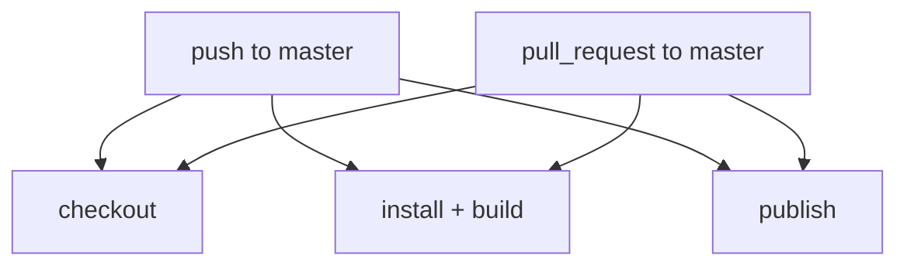
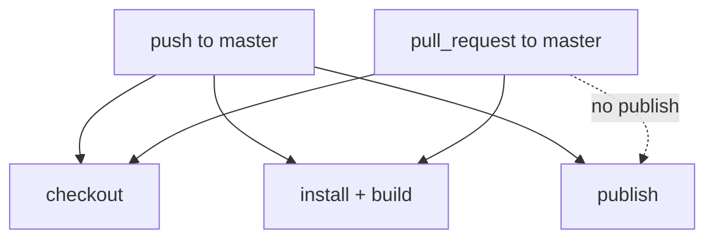

# Specification: Publish Custom Node Failure

**Date**: 2026-04-11  
**Agent**: research.agent  
**Status**: Draft  
**Related Plan**: `.github/plans/in-progress/app/distribution/github-actions/publish-custom-node-failure-2026-04-11/`  
**Based on Research**: `2-RESEARCH.md`

---

## 0. Business Context

### Problem Statement

The repository's GitHub Actions workflow currently runs the Comfy registry publish action for both `push` and `pull_request` events, and the observed failing run occurred on PR `#6` after build completed.

### User Impact

- PR validation is noisy or failing even when the actual code builds correctly.
- The workflow is structurally capable of attempting to publish unmerged code.
- Registry publishing depends on privileged credentials in a context where those credentials may not exist.

### Success Criteria

- [x] The publish failure is explained by workflow/event design rather than local build breakage
- [x] The minimal workflow change is identified
- [x] PR build validation remains intact
- [x] Publish semantics are restricted to trusted branch state

### Scope

**In Scope:**

- GitHub Actions trigger and conditional behavior
- Publish-step gating
- Separation of PR validation from registry publication

**Out of Scope:**

- Broader workflow redesign
- Registry token rotation or secret management beyond noting residual uncertainty
- Packaging or runtime node changes

---

## 1. Executive Summary

### What are we determining?

How the workflow should be changed so that `Build` continues to validate PRs, while `Publish Custom Node` only runs in the event context where publishing is appropriate.

### Determination

The publish action should only run on trusted `push` events to `master`, not on `pull_request` events. The smallest acceptable implementation is a step-level `if` guard on `Publish Custom Node`.

### Why?

The failing run was a PR run, and the publish step requires a privileged registry token. PR-triggered workflows are the wrong place to publish and may not receive secrets when the PR originates from a fork or Dependabot.

---

## 2. Architecture Design

### Current Flow



### Required Flow



### Key Architectural Decisions

**Decision 1**: Keep one workflow for both validation and publishing

- **Rationale**: The minimal fix is an `if` guard, not a workflow split.
- **Trade-off**: Publishing remains coupled to the build workflow, but the immediate incident is resolved with the smallest change.

**Decision 2**: Gate publish at the step level using event and branch context

- **Rationale**: This preserves current PR build coverage while preventing publish execution in PR runs.
- **Trade-off**: The job still exists on PRs, but the privileged action is skipped cleanly.

---

## 3. Functional Requirements

### FR1: Preserve PR validation

The workflow must continue to run checkout, install, and build for `pull_request` events targeting `master`.

### FR2: Restrict publish to trusted branch state

The workflow must only execute `Comfy-Org/publish-node-action@main` when the event is a `push` to `refs/heads/master`.

### FR3: Avoid unrelated workflow restructuring

The incident fix should be limited to conditional gating unless later implementation discovers a syntax or action constraint that makes step-level gating invalid.

---

## 4. Non-Functional Requirements

### NFR1: Minimality

Prefer a one-line conditional change over a multi-job or multi-workflow redesign.

### NFR2: Safety

Do not use `pull_request_target` as a shortcut to gain secret access, because that would increase the security risk of running untrusted PR code with privileged credentials.

### NFR3: Predictability

Publishing behavior must align with deploy semantics: only merged branch state should publish to the registry.

---

## 5. Implementation Outline

Modify `.github/workflows/vite-build.yml` so the publish step is conditionally executed only for pushes to `master`.

Target shape:

```yaml
- name: Publish Custom Node
  if: github.event_name == 'push' && github.ref == 'refs/heads/master'
  uses: Comfy-Org/publish-node-action@main
  with:
    personal_access_token: ${{ secrets.REGISTRY_ACCESS_TOKEN }}
    skip_checkout: 'true'
```

Optional future hardening, not required for this incident:

- run publish only when `pyproject.toml` changes
- move publish to a dedicated workflow triggered by `push` or `workflow_dispatch`
- publish from release tags instead of every push

---

## 6. Verification Plan

### Primary Verification

- Confirm the workflow syntax remains valid after adding the `if` guard.
- Confirm PR-triggered runs still execute `Build`.
- Confirm the publish step is skipped for PR runs and eligible only on `push` to `master`.

### Evidence Limits

- This environment cannot rerun the hosted GitHub Actions job directly.
- Full historic step logs are unavailable while logged out, so verification of the exact original error string is out of scope.

### Acceptance Test

1. Open or update a PR to `master` and verify `Build` runs while `Publish Custom Node` is skipped.
2. Push directly to `master` or merge the PR and verify the publish step becomes eligible.

---

## 7. Risks & Mitigations

### Risk: The secret is also invalid on `push`

Impact: A later push run could still fail in publish.

Mitigation: Treat token validity as a secondary operational check after fixing the event gating. The workflow design bug should be fixed first.

### Risk: Publishing on every push may still be too broad

Impact: Multiple registry publishes could occur without an intentional release process.

Mitigation: Consider later tightening with path, tag, or manual-dispatch filters.

---

## 8. Recommended Handoff

Implementation should update only `.github/workflows/vite-build.yml` and then run the narrowest available workflow validation or YAML sanity check locally. Hosted-run behavior after merge should be validated in GitHub Actions.
