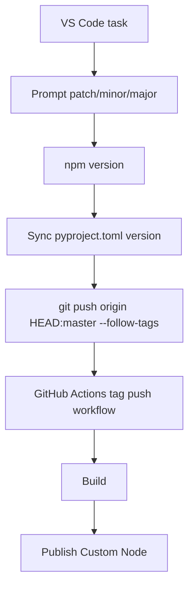

# Specification: Tag Release Task and Publish Flow

**Date**: 2026-04-11  
**Agent**: vibe-flow  
**Status**: Approved  
**Related Plan**: `.github/plans/in-progress/app/distribution/github-actions/tag-release-task-and-publish-2026-04-11/`  
**Based on Research**: `2-RESEARCH.md`

---

## 0. Business Context

### Problem Statement

Publishing currently occurs from the normal branch workflow, but the desired release behavior is explicit versioning followed by tag-driven publication.

### User Impact

The user gets a single release action in VS Code and avoids accidental registry publish attempts on ordinary branch pushes.

### Success Criteria

- [ ] A VS Code task prompts for `patch`, `minor`, or `major`
- [ ] The release flow uses `npm version`
- [ ] `pyproject.toml` stays in sync with the bumped npm version
- [ ] GitHub Actions publishes only on tag pushes

---

## 1. Executive Summary

Implement a small release flow centered on `npm version`, but synchronize Python metadata so the registry publish action sees the same version. Add a VS Code task for interactive release bumps and change the publish workflow to run on tag pushes while preserving PR build validation.

---

## 2. Architecture Design

### Desired Flow

### Key Decisions

**Decision 1**: Keep `npm version` as the operator command

- **Rationale**: Matches the user request.

**Decision 2**: Sync `pyproject.toml` automatically

- **Rationale**: Registry publish uses Python metadata version.

**Decision 3**: Trigger publish on tag pushes

- **Rationale**: Makes publishing explicit and release-driven.

---

## 3. Implementation Outline

### Task A: Sync package versions

- Add or correct `package.json.version` so it matches `pyproject.toml`
- Add a small helper or npm lifecycle hook that writes the bumped version into `pyproject.toml`

### Task B: Add VS Code task

- Create `.vscode/tasks.json`
- Add `pickString` input for `patch`, `minor`, `major`
- Execute release command and push commit/tag to `master`

### Task C: Change workflow triggers

- Keep `pull_request` on `master`
- Change `push` trigger to version tags such as `v*`
- Gate publish step for tag pushes instead of branch pushes

---

## 4. Verification Plan

- Validate the version sync logic locally
- Validate `tasks.json` structure and command shape
- Validate workflow YAML syntax and tag-based publish semantics statically
- Document any hosted-run limitations that cannot be proven locally

---

## 5. Acceptance Criteria

- [ ] Release task exists and is interactive
- [ ] Version bump updates both `package.json` and `pyproject.toml`
- [ ] Push workflow publishes only on version tags
- [ ] PR builds still run