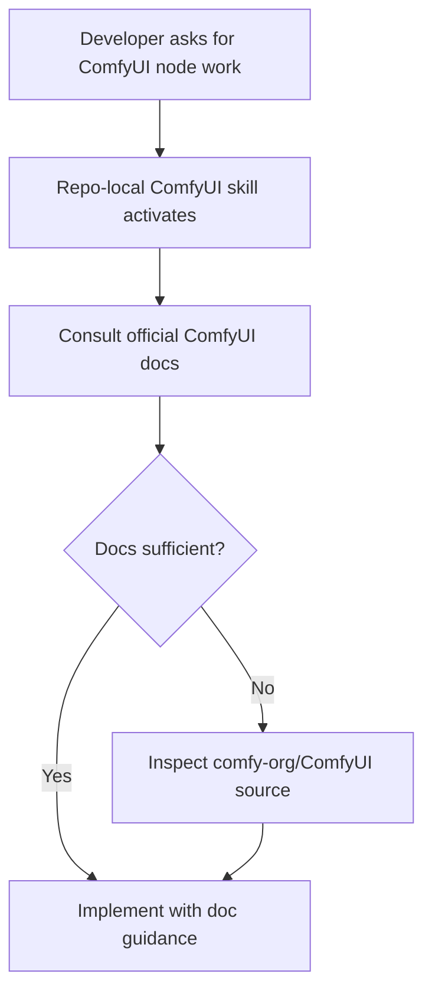

# Specification: ComfyUI Development Skill

**Date**: 2026-04-11  
**Agent**: vibe-flow  
**Status**: Approved  
**Related Plan**: `.github/plans/in-progress/app/nodes/video/comfyui-development-skill-2026-04-11/`  
**Based on Research**: `2-RESEARCH.md`

---

## 0. Business Context

### Problem Statement

The repository does not yet provide a repo-local skill that guides the LLM toward the right ComfyUI references during custom-node development work.

### User Impact

Without a dedicated skill, ComfyUI development assistance may miss the most relevant docs or fail to compensate when the docs are stale relative to the upstream code.

### Success Criteria

- [ ] A repo-local skill exists for ComfyUI custom-node development.
- [ ] The skill references the official custom-node and server-comms docs.
- [ ] The skill instructs the agent to inspect upstream ComfyUI source when documentation is incomplete.
- [ ] Validation shows the touched markdown/config surface is clean.

### Scope

**In Scope:**

- Create `.github/skills/comfyui-development/SKILL.md`
- Add concise activation criteria and usage guidance
- Reference the user-provided ComfyUI docs and upstream repository
- Perform focused validation appropriate for a markdown skill addition

**Out of Scope:**

- Changes to the custom node runtime implementation
- Broad repo documentation reorganization
- New external automation beyond the skill itself

---

## 1. Executive Summary

### What are we building?

A repo-local skill that activates for ComfyUI custom-node development tasks and directs the agent toward official docs first, then upstream ComfyUI source when the docs do not fully reflect current behavior.

### Why?

This makes future development assistance more accurate and repeatable for ComfyUI-specific work in this repository.

### Success Metrics

- Skill file exists under `.github/skills/comfyui-development/`
- Skill content clearly names activation triggers and reference sources
- Focused validation passes on the touched surface

---

## 2. Architecture Design

### System Overview

### Key Architectural Decisions

**Decision 1**: Use a dedicated repo-local skill

- **Rationale**: Keeps the guidance isolated, reusable, and aligned with the user request.
- **Trade-offs**: Requires the skill format to be written clearly enough to load/use correctly.

**Decision 2**: Prefer docs first, source second

- **Rationale**: Official docs are the best primary reference when current and complete.
- **Trade-offs**: Requires an explicit fallback so the agent does not stop at stale documentation.

---

## 3. API / Interface Changes

### Modified Interfaces

No application runtime interfaces change. The new interface is a repo-local skill definition used by the agent.

---

## 4. Data Model Changes

No data model changes are planned.

---

## 5. Implementation Steps

### Phase 1: Skill authoring

**Goal**: Add a practical ComfyUI development skill to the repo.

**Tasks**:

1. Create `.github/skills/comfyui-development/SKILL.md`.
2. Add activation conditions covering ComfyUI custom-node development, server comms, and related debugging.
3. Reference the official docs provided by the user.
4. Add explicit fallback guidance to inspect `https://github.com/comfy-org/ComfyUI` when docs lag behavior.

**Deliverables**:

- [ ] New repo-local skill file
- [ ] Clear activation and reference guidance

**Estimated Effort**: <0.5 day

---

### Phase 2: Validation

**Goal**: Prove the addition is structurally correct and clean.

**Tasks**:

1. Verify the skill file exists in the expected location.
2. Check diagnostics on touched markdown/config files.
3. Confirm the content includes the required references and fallback behavior.

**Deliverables**:

- [ ] Skill file present and readable
- [ ] Diagnostics clean
- [ ] Required references present

**Estimated Effort**: <0.5 day

---

## 6. Testing Strategy

### Unit Tests

- Not required unless the repo already has automated validation for skill files.

### Integration Tests

- Not required for this bounded markdown-only change.

### Manual Testing

- Confirm the skill content is discoverable in the repo and matches the requested reference strategy.

---

## 7. Rollout Plan

- Land as a normal repo update.
- Use the new skill in subsequent ComfyUI development tasks.

---

## 8. Risks & Mitigations

- If repo-local skills require an additional manifest or asset structure, add only the minimal supporting file(s).
- If the docs evolve, the upstream repository fallback keeps the skill useful even before documentation catches up.