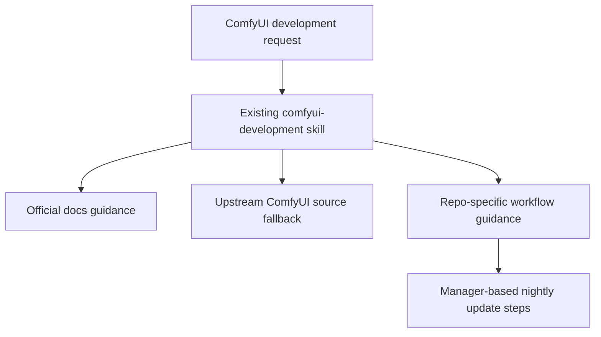

# Specification: ComfyUI Skill Workflow Update

**Date**: 2026-04-11  
**Agent**: vibe-flow  
**Status**: Approved  
**Related Plan**: `.github/plans/in-progress/app/nodes/video/comfyui-development-skill-workflow-update-2026-04-11/`  
**Based on Research**: `2-RESEARCH.md`

---

## 0. Business Context

### Problem Statement

The existing ComfyUI development skill describes general docs and source-reference guidance, but it does not yet encode this repo's current development workflow or the practical manager-based update path for the node pack.

### User Impact

Without that workflow context, future ComfyUI development assistance may assume a release-based install flow when the active environment is actually tracking nightly code from `master`, and it may omit the fastest browser-based update path.

### Success Criteria

- [ ] The skill documents the current nightly-versus-release workflow.
- [ ] The skill includes the browser update steps with the verified manager labels.
- [ ] Existing docs-first and upstream-source fallback guidance remains intact.
- [ ] Validation shows the touched markdown surface is clean.

### Scope

**In Scope:**

- Modify `.github/skills/comfyui-development/SKILL.md`
- Add compact repo workflow guidance
- Add compact browser-based update instructions
- Perform focused markdown/content validation

**Out of Scope:**

- Any runtime or packaging code changes
- Broader documentation reorganization
- Automation around manager updates

---

## 1. Executive Summary

### What are we building?

A small update to the existing ComfyUI development skill so it reflects the real repo workflow and the live ComfyUI Manager update path.

### Why?

This keeps future ComfyUI-related assistance grounded in how the node pack is actually developed and refreshed in the active environment.

### Success Metrics

- Skill mentions nightly on the development ComfyUI instance and rare release installs on production while development is inactive
- Skill includes `Manager` → `Custom Nodes Manager` → `Installed`/search/`Try update` guidance
- Focused validation passes

---

## 2. Architecture Design

### System Overview

### Key Architectural Decisions

**Decision 1**: Extend the existing skill instead of creating a second one

- **Rationale**: The existing skill is the natural owning surface and already handles the same task family.
- **Trade-offs**: Requires keeping the added workflow guidance concise so the skill stays usable.

**Decision 2**: Use verified live UI labels in the workflow steps

- **Rationale**: Avoids stale or approximate instructions for the manager flow.
- **Trade-offs**: These labels may need maintenance if the live UI changes later.

---

## 3. API / Interface Changes

### Modified Interfaces

No application runtime interface changes. The update only changes the agent-facing repo-local skill content.

---

## 4. Data Model Changes

No data model changes are planned.

---

## 5. Implementation Steps

### Phase 1: Skill update

**Goal**: Add the missing repo workflow and update-path guidance.

**Tasks**:

1. Add a short workflow section describing the nightly install on `https://prd-comfyui.devlabhq.com/` and the rare use of released versions on production when not actively developing.
2. Add a short manager update checklist using the verified labels.
3. Preserve the existing docs-first and upstream-source fallback instructions.

**Deliverables**:

- [ ] Updated skill with repo workflow guidance
- [ ] Updated skill with browser update instructions

**Estimated Effort**: <0.5 day

---

### Phase 2: Validation

**Goal**: Prove the skill content is accurate and clean.

**Tasks**:

1. Check diagnostics on the touched skill file.
2. Confirm the workflow text and update steps are present.
3. Confirm the existing docs/source-reference guidance still exists.

**Deliverables**:

- [ ] Diagnostics clean
- [ ] Required workflow and update text present
- [ ] Existing guidance preserved

**Estimated Effort**: <0.5 day

---

## 6. Testing Strategy

### Unit Tests

- Not required for this markdown-only update.

### Integration Tests

- Not required for this bounded documentation/instructions change.

### Manual Testing

- Verify the skill content matches the current live ComfyUI Manager labels already observed.

---

## 7. Rollout Plan

- Land as a normal repo update.
- Use the richer skill in future ComfyUI development tasks.

---

## 8. Risks & Mitigations

- If the manager UI labels change, update the skill with the new wording rather than weakening the steps now.
- If the dev workflow changes away from nightly, revise the workflow section to avoid stale local guidance.