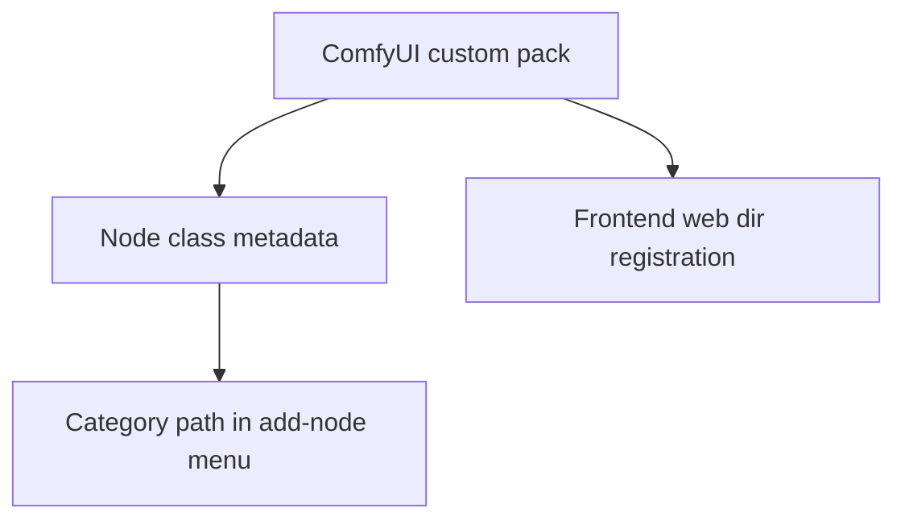

# Specification: Custom Pack Top-Level Node Category

**Date**: 2026-04-11  
**Agent**: vibe-flow  
**Status**: Approved  
**Related Plan**: `.github/plans/in-progress/app/nodes/video/custom-pack-top-level-category-2026-04-11/`  
**Based on Research**: `2-RESEARCH.md`

---

## 0. Business Context

### Problem Statement

The custom node is currently harder to find in the ComfyUI add-node menu because it does not appear under a top-level directory aligned with the custom pack name.

### User Impact

Users have to search or browse generic categories instead of navigating directly through the custom pack namespace.

### Success Criteria

- [ ] The node appears under a top-level menu path aligned with the custom pack name.
- [ ] Existing node behavior, inputs, and outputs remain unchanged.
- [ ] Validation proves the menu/category metadata changed as intended.

### Scope

**In Scope:**

- Node category/registration metadata update
- Focused backend validation or test adjustment
- Small documentation note if the visible node path changes

**Out of Scope:**

- Runtime behavior changes for loading video
- Broad package renames or distribution changes

---

## 1. Executive Summary

### What are we building?

A small metadata change so the custom node is organized beneath a custom-pack top-level menu path in ComfyUI.

### Why?

This improves discoverability and aligns the node browser structure with the pack identity already used by the extension.

### Success Metrics

- Node category path starts with the desired pack label
- No behavior regressions in focused tests
- Documentation stays accurate if menu location is mentioned

---

## 2. Architecture Design

### System Overview



### Key Architectural Decisions

**Decision 1**: Change only the menu/category metadata first

- **Rationale**: This is the narrowest plausible fix for node discoverability.
- **Trade-offs**: Assumes the current issue is controlled by category metadata rather than a broader package registration problem.

**Decision 2**: Reuse the existing pack identity where practical

- **Rationale**: Avoids introducing a second naming source for the same pack.
- **Trade-offs**: The displayed label may need sanitization if the project name is not a good category string.

---

## 3. API / Interface Changes

### Modified Interfaces

```python
# BEFORE
CATEGORY = "...existing generic path..."

# AFTER
CATEGORY = "<custom-pack-name>/..."
```

No runtime input/output contract changes are planned.

---

## 4. Data Model Changes

No data model changes are planned.

---

## 5. Implementation Steps

### Phase 1: Metadata fix

**Goal**: Update the node so ComfyUI shows it under the custom pack top-level directory.

**Tasks**:

1. Verify the exact field controlling menu placement.
2. Set the category path to start with the pack-aligned label.
3. Keep node mappings and display names stable unless a stronger fix is required.

**Deliverables**:

- [ ] Updated node category metadata
- [ ] Stable node export wiring

**Estimated Effort**: <0.5 day

---

### Phase 2: Validation

**Goal**: Prove the change without widening scope.

**Tasks**:

1. Add or update a focused test/assertion for category metadata.
2. Run the narrowest relevant test suite.
3. Update README only if it references menu placement.

**Deliverables**:

- [ ] Focused validation passing
- [ ] Optional README note aligned with behavior

**Estimated Effort**: <0.5 day

---

## 6. Testing Strategy

### Unit Tests

- Assert the node registration and category metadata expose the pack-aligned path.

### Integration Tests

- Not required unless metadata cannot be proven through a focused backend check.

### Manual Testing

- Optional ComfyUI visual confirmation if the environment is available.

---

## 7. Rollout Plan

- Ship as a normal package update.
- No migration steps required.

---

## 8. Risks & Mitigations

- If ComfyUI menu placement is not controlled solely by category metadata, step one hop to the owning registration point and adjust there.
- If the pack name is unsuitable as a category label, introduce a stable constant rather than changing the project package name.
